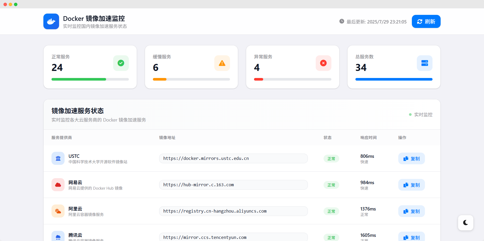

# Docker 镜像加速服务监控

一个专业的 Docker 镜像加速服务监控平台，实时监控国内 33+ 个 Docker Hub 镜像加速服务的可用性和响应时间。

## 🌟 功能特性

- **实时监控**: 监控 33+ 个国内 Docker 镜像加速服务
- **状态检测**: 实时检测服务可用性和响应时间
- **响应式设计**: 完美适配桌面端和移动端
- **深色模式**: 支持浅色/深色主题切换
- **一键复制**: 快速复制镜像地址到剪贴板
- **自动刷新**: 每 5 分钟自动更新服务状态
- **配置指南**: 提供详细的 Docker 配置教程

## 📸 项目演示



*实时监控界面展示 - 支持深色/浅色主题切换，响应式设计完美适配各种设备*

## 📊 监控的服务提供商

### 🏢 云服务商
- **阿里云**: registry.cn-hangzhou.aliyuncs.com
- **腾讯云**: mirror.ccs.tencentyun.com
- **华为云**: swr.cn-north-1.myhuaweicloud.com
- **百度云**: mirror.baidubce.com
- **京东云**: hub-mirror.jdcloud.com
- **字节跳动**: cr.volcengine.com
- **七牛云**: reg-mirror.qiniu.com
- **又拍云**: docker.mirrors.upyun.com
- **Azure 中国**: dockerhub.azk8s.cn

### 🎓 高校镜像站
- **中科大**: docker.mirrors.ustc.edu.cn
- **清华大学**: mirrors.tuna.tsinghua.edu.cn/docker-ce
- **上海交大**: docker.mirrors.sjtug.sjtu.edu.cn
- **南京大学**: docker.nju.edu.cn

### 🌐 第三方服务
- **网易云**: hub-mirror.c.163.com
- **DaoCloud**: f1361db2.m.daocloud.io
- **Docker 官方中国**: registry.docker-cn.com
- **毫秒镜像**: docker.1ms.run
- **1Panel**: docker.1panel.live
- **耗子面板**: hub.rat.dev
- **轩辕镜像**: docker.xuanyuan.me
- **DockerProxy**: dockerproxy.net
- 以及更多...

## 🚀 快速开始

### 环境要求

#### 前端要求
- 现代浏览器（Chrome、Firefox、Safari、Edge）
- 支持 ES6+ 的 JavaScript 环境

#### 后端要求
- **PHP**: 7.4+ (推荐 8.0+)
- **Web服务器**: Apache 2.4+ 或 Nginx 1.18+
- **PHP扩展**: curl, json, mbstring

### 部署方式

#### 1. 完整部署（推荐）
```bash
# 克隆项目
git clone https://github.com/mcwlgzs/docker-mirror-monitor.git
cd docker-mirror-monitor

# 设置目录权限
chmod 755 backend/
chmod 777 backend/cache/ backend/logs/

# 配置Web服务器（Apache/Nginx）
# 详见 DEPLOYMENT.md 文档
```

#### 2. 仅前端部署（演示模式）
```bash
# 使用任意 HTTP 服务器运行前端
python -m http.server 8000
# 或
npx serve .
```

#### 2. Nginx 部署
```nginx
server {
    listen 80;
    server_name your-domain.com;
    root /path/to/docker-mirror-monitor;
    index index.html;
    
    location / {
        try_files $uri $uri/ =404;
    }
    
    # 启用 gzip 压缩
    gzip on;
    gzip_types text/css application/javascript text/javascript;
}
```

#### 3. Apache 部署
```apache
<VirtualHost *:80>
    ServerName your-domain.com
    DocumentRoot /path/to/docker-mirror-monitor
    
    <Directory /path/to/docker-mirror-monitor>
        AllowOverride All
        Require all granted
    </Directory>
</VirtualHost>
```

## 📁 项目结构

```
docker-mirror-monitor/
├── index.html          # 主页面文件
├── script.js           # JavaScript 逻辑
├── favicon.ico         # 网站图标
└── README.md          # 项目说明文档
```

## 🔧 配置说明

### Docker 配置指南

#### macOS / Linux 配置
```bash
# 创建或编辑 daemon.json
sudo mkdir -p /etc/docker
sudo tee /etc/docker/daemon.json <<-'EOF'
{
  "registry-mirrors": [
    "https://docker.mirrors.ustc.edu.cn",
    "https://hub-mirror.c.163.com"
  ]
}
EOF

# 重启 Docker 服务
sudo systemctl daemon-reload
sudo systemctl restart docker
```

#### Windows 配置
1. 右键点击 Docker Desktop 图标
2. 选择 "Settings" 或 "设置"
3. 点击 "Docker Engine"
4. 在配置文件中添加镜像地址
5. 点击 "Apply & Restart"

## 💻 技术栈

### 前端技术
- **前端框架**: 原生 HTML5 + CSS3 + JavaScript (ES6+)
- **CSS 框架**: Tailwind CSS (CDN)
- **图标库**: Font Awesome 6.0
- **字体**: SF Pro Display (Apple 系统字体)
- **设计风格**: Apple Design Language

### 后端技术
- **后端语言**: PHP 7.4+ (推荐 8.0+)
- **Web服务器**: Apache/Nginx
- **API架构**: RESTful API
- **缓存机制**: 文件缓存系统
- **并发处理**: cURL Multi Handle

## 🎨 设计特色

- **Apple 风格设计**: 采用 Apple 设计语言，简洁优雅
- **毛玻璃效果**: 现代化的视觉效果
- **响应式布局**: 完美适配各种设备尺寸
- **无障碍支持**: 符合 WCAG 2.1 标准
- **SEO 优化**: 完整的 meta 标签和结构化数据

## 📱 功能详解

### 状态监控
- **正常**: 响应时间 < 2000ms，服务可用
- **缓慢**: 响应时间 ≥ 2000ms，服务可用但较慢
- **异常**: 服务不可用或连接超时
- **检查中**: 正在检测服务状态

### 响应时间级别
- **极快**: < 500ms
- **快速**: 500ms - 1000ms
- **正常**: 1000ms - 2000ms
- **缓慢**: > 2000ms

### 自动化功能
- 页面加载时自动检测所有服务
- 每 5 分钟自动刷新状态
- 手动刷新按钮支持
- 实时更新最后检查时间

## 🔄 API 说明

### 服务状态检测
```javascript
// 检查单个服务状态
async function checkServiceStatus(service) {
    // 实际部署时需要后端 API 支持
    // 当前为模拟数据，避免 CORS 限制
}
```

**注意**: 由于浏览器 CORS 限制，当前版本使用模拟数据。在生产环境中，建议：
1. 部署后端 API 服务进行实际检测
2. 使用服务器端渲染 (SSR)
3. 配置代理服务器绕过 CORS 限制

## 🛠️ 自定义配置

### 添加新的镜像服务
在 `script.js` 中的 `dockerServices` 数组添加新服务：

```javascript
{
    name: '服务名称',
    url: 'https://your-mirror-url.com',
    provider: '提供商名称',
    description: '服务描述'
}
```

### 修改检测间隔
```javascript
// 修改自动刷新间隔（默认 5 分钟）
setInterval(() => {
    checkAllServices();
    updateLastUpdateTime();
}, 5 * 60 * 1000); // 修改这里的数值
```

### 自定义主题色彩
在 `index.html` 的 Tailwind 配置中修改：

```javascript
tailwind.config = {
    theme: {
        extend: {
            colors: {
                'docker-blue': '#007AFF', // 修改主色调
                // 添加更多自定义颜色
            }
        }
    }
}
```

## 🔍 SEO 优化

- 完整的 meta 标签配置
- 结构化数据 (JSON-LD)
- 语义化 HTML 标签
- 无障碍访问支持
- 移动端优化

## 📈 性能优化

- CSS/JS 资源 CDN 加载
- 图片懒加载
- 代码压缩
- 浏览器缓存策略
- 响应式图片

## 🤝 贡献指南

1. Fork 本项目
2. 创建特性分支 (`git checkout -b feature/AmazingFeature`)
3. 提交更改 (`git commit -m 'Add some AmazingFeature'`)
4. 推送到分支 (`git push origin feature/AmazingFeature`)
5. 开启 Pull Request

## 📄 许可证

本项目采用 MIT 许可证 - 查看 [LICENSE](LICENSE) 文件了解详情。

## 🙏 致谢

- 感谢所有提供 Docker 镜像加速服务的机构和个人
- 感谢开源社区的贡献者们
- 特别感谢各大高校和云服务商的支持

## 📞 联系方式

- 项目地址: [GitHub Repository]
- 问题反馈: [Issues]
- 邮箱: mcwlgzs@qq.com

---

**免责声明**: 本项目仅用于监控和展示目的，数据仅供参考，请以实际使用为准。
