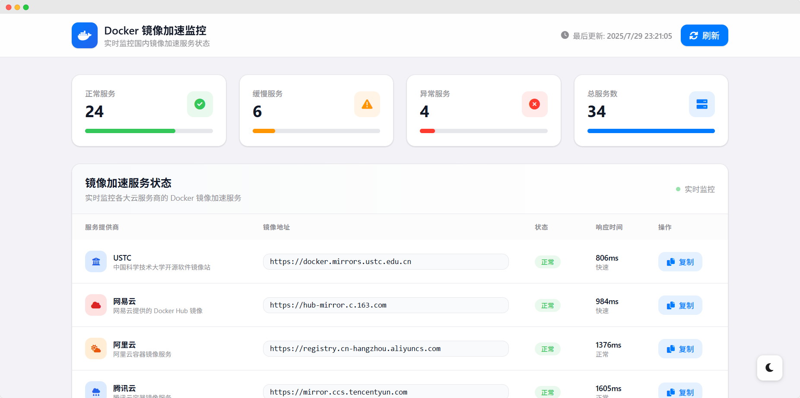

# Docker 镜像加速服务监控

一个专业的 Docker 镜像加速服务监控平台，实时监控国内 14 个 Docker Hub 镜像加速服务的可用性和响应时间。

## 功能特性

- **实时监控**: 监控 14 个国内 Docker 镜像加速服务
- **并发检测**: 使用 cURL Multi Handle 并发检测所有服务
- **备用检测**: 当第三方 Ping API 不可用时，自动回退到直接 cURL 检测
- **排序筛选**: 支持按提供商、状态、响应时间排序，按状态筛选
- **响应式设计**: 完美适配桌面端和移动端
- **深色模式**: 支持浅色/深色主题切换，跟随系统偏好
- **一键复制**: 快速复制镜像地址到剪贴板
- **自动刷新**: 每 5 分钟自动更新服务状态
- **配置指南**: 提供 macOS/Linux/Windows 的 Docker 配置教程
- **缓存机制**: 10 分钟文件缓存，减少重复请求
- **速率限制**: 防止 API 被滥用
- **健康检查**: 提供系统自身健康检查端点

## 项目演示



## 监控的服务提供商

### 云服务商
- **阿里云**: registry.cn-hangzhou.aliyuncs.com
- **腾讯云**: mirror.ccs.tencentyun.com
- **华为云**: swr.cn-north-1.myhuaweicloud.com

### 高校镜像站
- **中科大**: docker.mirrors.ustc.edu.cn
- **上海交大**: docker.mirrors.sjtug.sjtu.edu.cn
- **南京大学**: docker.nju.edu.cn

### 第三方服务
- **毫秒镜像**: docker.1ms.run
- **1Panel**: docker.1panel.live
- **耗子面板**: hub.rat.dev
- **DockerProxy**: dockerproxy.net
- **科技lion**: docker.kejilion.pro
- **开放原子**: atomhub.openatom.cn
- **DockerPull**: dockerpull.com
- **Docker Hub**: hub.docker.com

## 快速开始

### 环境要求

- **PHP**: 7.4+（推荐 8.0+）
- **PHP 扩展**: curl, json, mbstring
- **Web 服务器**: Apache 2.4+ 或 Nginx 1.18+
- **浏览器**: Chrome、Firefox、Safari、Edge 等现代浏览器

### 部署方式

#### 1. 完整部署（推荐）

```bash
# 克隆项目
git clone https://github.com/mcwlgzs/docker-mirror-monitor.git
cd docker-mirror-monitor

# 设置目录权限
chmod 755 cache/ logs/
# 如果目录不存在会自动创建
```

#### 2. Nginx 配置

```nginx
server {
    listen 80;
    server_name your-domain.com;
    root /path/to/docker-mirror-monitor;
    index index.html;

    location / {
        try_files $uri $uri/ =404;
    }

    location ~ \.php$ {
        fastcgi_pass unix:/run/php/php-fpm.sock;
        fastcgi_param SCRIPT_FILENAME $document_root$fastcgi_script_name;
        include fastcgi_params;
    }

    gzip on;
    gzip_types text/css application/javascript text/javascript application/json;
}
```

#### 3. Apache 配置

```apache
<VirtualHost *:80>
    ServerName your-domain.com
    DocumentRoot /path/to/docker-mirror-monitor

    <Directory /path/to/docker-mirror-monitor>
        AllowOverride All
        Require all granted
    </Directory>
</VirtualHost>
```

#### 4. 仅前端部署（演示模式）

```bash
# 使用任意 HTTP 服务器运行前端（无后端时自动进入演示模式）
python -m http.server 8000
# 或
npx serve .
```

## 项目结构

```
docker-mirror-monitor/
├── index.html          # 主页面
├── script.js           # 前端逻辑（排序、筛选、主题切换等）
├── api.php             # 后端 API（并发检测、缓存、速率限制）
├── config.php          # 配置文件（服务列表、超时、CORS 等）
├── test.html           # 开发调试页面
├── favicon.ico         # 网站图标
├── demo.png            # 项目演示截图
├── cache/              # 缓存目录（自动创建）
├── logs/               # 日志目录（自动创建）
└── README.md           # 项目说明
```

## API 说明

| 端点 | 方法 | 说明 |
|------|------|------|
| `?action=get_services` | GET | 获取服务列表 |
| `?action=check_all` | GET/POST | 检测所有 14 个服务 |
| `?action=quick_check` | GET | 快速检测前 10 个服务 |
| `?action=check_service` | POST | 检测单个服务 `{"url": "..."}` |
| `?action=health` | GET | 系统健康检查 |

参数说明：
- `?force` - 跳过缓存，强制重新检测

## 配置说明

所有配置集中在 [config.php](config.php) 中管理：

```php
return [
    'services' => [...],           // Docker 镜像服务列表
    'cache' => ['duration' => 600], // 缓存时长（秒）
    'timeout' => ['default' => 3],  // 检测超时（秒）
    'cors_origins' => [...],        // CORS 白名单
    'rate_limit' => [               // 速率限制
        'max_requests' => 30,
        'window' => 60,
    ],
    'thresholds' => [               // 状态阈值（毫秒）
        'fast' => 500,
        'fair' => 1000,
        'slow' => 2000,
    ],
];
```

### 添加新的镜像服务

在 `config.php` 的 `services` 数组中添加：

```php
['name' => '服务名称', 'url' => 'https://your-mirror.com', 'provider' => '提供商', 'description' => '描述'],
```

前端会自动从后端获取最新服务列表，无需手动同步。

## 技术栈

### 前端
- HTML5 + CSS3 + JavaScript (ES6+)
- Tailwind CSS (CDN)
- Font Awesome 6.0
- Apple Design Language 风格

### 后端
- PHP 7.4+
- cURL Multi Handle 并发检测
- 文件缓存系统
- RESTful API

## 状态说明

| 状态 | 响应时间 | 说明 |
|------|----------|------|
| 快速 (fast) | < 500ms | 服务响应极快 |
| 一般 (fair) | 500-1000ms | 服务响应正常 |
| 缓慢 (slow) | 1000-2000ms | 服务响应较慢 |
| 异常 (error) | > 2000ms 或无响应 | 服务不可用 |

## 贡献指南

1. Fork 本项目
2. 创建特性分支 (`git checkout -b feature/AmazingFeature`)
3. 提交更改 (`git commit -m 'Add some AmazingFeature'`)
4. 推送到分支 (`git push origin feature/AmazingFeature`)
5. 开启 Pull Request

## 许可证

本项目采用 MIT 许可证。

## 联系方式

- 项目地址: [GitHub](https://github.com/mcwlgzs/docker-mirror-monitor)
- 问题反馈: [Issues](https://github.com/mcwlgzs/docker-mirror-monitor/issues)
- 邮箱: mcwlgzs@qq.com

---

**免责声明**: 本项目仅用于监控和展示目的，数据仅供参考，请以实际使用为准。
